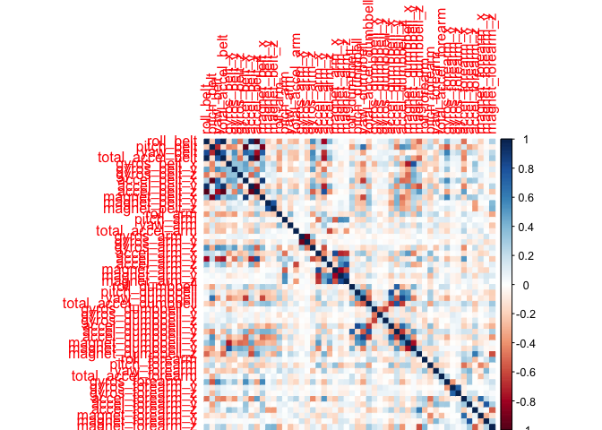
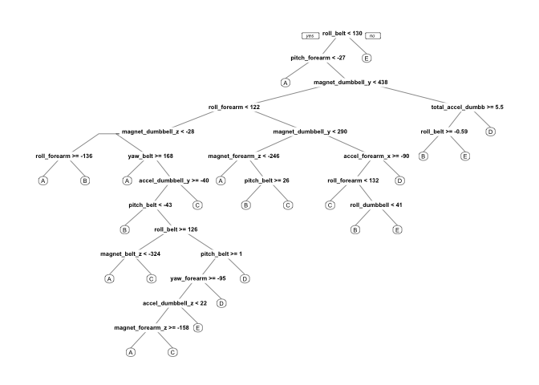

Executive Summary
-----------------

The goal of this project is to predict the manner in which the
participants did the exercise. This is the "classe" variable in the
training set. We will use the randomForest method in this analysis and
cross validate. We will also estimate the out-of-sample error and test
our model with the test dataset.

Background
----------

Using devices such as Jawbone Up, Nike FuelBand, and Fitbit it is now
possible to collect a large amount of data about personal activity
relatively inexpensively. These type of devices are part of the
quantified self movement – a group of enthusiasts who take measurements
about themselves regularly to improve their health, to find patterns in
their behavior, or because they are tech geeks. One thing that people
regularly do is quantify how much of a particular activity they do, but
they rarely quantify how well they do it. In this project, your goal
will be to use data from accelerometers on the belt, forearm, arm, and
dumbell of 6 participants. They were asked to perform barbell lifts
correctly and incorrectly in 5 different ways. More information is
available from the website here:
<http://groupware.les.inf.puc-rio.br/har> (see the section on the Weight
Lifting Exercise Dataset).

Loading necesary packages
-------------------------

We will need the following packages to perform this analysis.

    library(caret)

    ## Loading required package: lattice

    ## Loading required package: ggplot2

    library(randomForest)

    ## randomForest 4.6-12

    ## Type rfNews() to see new features/changes/bug fixes.

    ## 
    ## Attaching package: 'randomForest'

    ## The following object is masked from 'package:ggplot2':
    ## 
    ##     margin

    library(rpart)
    library(rpart.plot)
    library(ggplot2)
    library(corrplot)

Downloading & reading data into R
---------------------------------

Training & testing data can be found on the following link. Read data
into R with the read.csv command.

    trainUrl <-"https://d396qusza40orc.cloudfront.net/predmachlearn/pml-training.csv"
    testUrl <- "https://d396qusza40orc.cloudfront.net/predmachlearn/pml-testing.csv"
    trainFile <- "./data/pml-training.csv"
    testFile  <- "./data/pml-testing.csv"
    if (!file.exists("./data")) {
      dir.create("./data")
    }
    if (!file.exists(trainFile)) {
      download.file(trainUrl, destfile=trainFile, method="curl")
    }
    if (!file.exists(testFile)) {
      download.file(testUrl, destfile=testFile, method="curl")
    }
    train <- read.csv("./data/pml-training.csv")
    test  <- read.csv("./data/pml-testing.csv")

Cleaning the data
-----------------

First off, we remove columns that have many missing values.

    train <- train[, colSums(is.na(train)) == 0] 
    test  <- test[, colSums(is.na(test)) == 0] 

Next, we remove the columns that are not related to our analysis of
accelerometers. These are the X, timestamp, and the window variables.

    train <- train[, !(grepl("^X|timestamp|window", names(train)))]
    test  <- test[, !(grepl("^X|timestamp|window", names(test)))]

We remove the rest of the variables that are meaningless to our
analysis. Examples include variables that are missing in the test data
or variables that have observations such as "DIV/0". We also remove the
index variable for the same reason.

    classe <- train$classe
    train  <- train[, sapply(train, is.numeric)]
    train$classe <- classe
    test   <- test[, sapply(test, is.numeric)]
    test   <- test[, -length(names(test))]

Partitioning the data
---------------------

We split the training data into subsets of training and test data for
cross validation.

    inTrain   <- createDataPartition(train$classe, p=0.75, list=F)
    subtrain <- train[inTrain, ]
    subtest  <- train[-inTrain, ]

Fitting a model
---------------

Now that we have a training and test data set that we can use for cross
validation, we can proceed to fitting a model. We will use the
randomForest method because it automatically selects important
variables. We will use the 5-fold cross validation in applying the
model.

    fitRF <- train(classe ~ ., data=subtrain, method="rf", trControl=trainControl(method="cv", 5), ntree=250)
    fitRF

    ## Random Forest 
    ## 
    ## 14718 samples
    ##    52 predictor
    ##     5 classes: 'A', 'B', 'C', 'D', 'E' 
    ## 
    ## No pre-processing
    ## Resampling: Cross-Validated (5 fold) 
    ## Summary of sample sizes: 11776, 11774, 11775, 11773, 11774 
    ## Resampling results across tuning parameters:
    ## 
    ##   mtry  Accuracy   Kappa    
    ##    2    0.9914393  0.9891704
    ##   27    0.9919143  0.9897710
    ##   52    0.9842371  0.9800580
    ## 
    ## Accuracy was used to select the optimal model using  the largest value.
    ## The final value used for the model was mtry = 27.

Now we can fit the model and test its performance on the validation test
set.

    predictRF <- predict(fitRF, subtest)
    confusionMatrix(subtest$classe, predictRF)

    ## Confusion Matrix and Statistics
    ## 
    ##           Reference
    ## Prediction    A    B    C    D    E
    ##          A 1393    1    0    0    1
    ##          B    4  940    5    0    0
    ##          C    0    6  841    8    0
    ##          D    1    2    8  793    0
    ##          E    0    1    0    4  896
    ## 
    ## Overall Statistics
    ##                                          
    ##                Accuracy : 0.9916         
    ##                  95% CI : (0.9887, 0.994)
    ##     No Information Rate : 0.2851         
    ##     P-Value [Acc > NIR] : < 2.2e-16      
    ##                                          
    ##                   Kappa : 0.9894         
    ##  Mcnemar's Test P-Value : NA             
    ## 
    ## Statistics by Class:
    ## 
    ##                      Class: A Class: B Class: C Class: D Class: E
    ## Sensitivity            0.9964   0.9895   0.9848   0.9851   0.9989
    ## Specificity            0.9994   0.9977   0.9965   0.9973   0.9988
    ## Pos Pred Value         0.9986   0.9905   0.9836   0.9863   0.9945
    ## Neg Pred Value         0.9986   0.9975   0.9968   0.9971   0.9998
    ## Prevalence             0.2851   0.1937   0.1741   0.1642   0.1829
    ## Detection Rate         0.2841   0.1917   0.1715   0.1617   0.1827
    ## Detection Prevalence   0.2845   0.1935   0.1743   0.1639   0.1837
    ## Balanced Accuracy      0.9979   0.9936   0.9907   0.9912   0.9988

We observe that the accuracy is high at 99.45%. Based upon this result,
we can estimate the out-of-sample error also.

    oose <- 1 - as.numeric(confusionMatrix(subtest$classe, predictRF)$overall[1])
    oose

    ## [1] 0.008360522

The estimated out-of-sample error is 0.55%.

Test data prediction
--------------------

We are now ready to plug in the real test data into our model.

    predict(fitRF, test)

    ##  [1] B A B A A E D B A A B C B A E E A B B B
    ## Levels: A B C D E

Appendix
--------

Included in the appendix are a couple plots to help visualization of our
analysis.

-   Correleation Matrix

<!-- -->

    corrPlot <- cor(subtrain[, -length(names(subtrain))])
    corrplot(corrPlot, method="color")

-   Tree Visualization

<!-- -->

    treeModel <- rpart(classe ~ ., data=subtrain, method="class")
    prp(treeModel)

